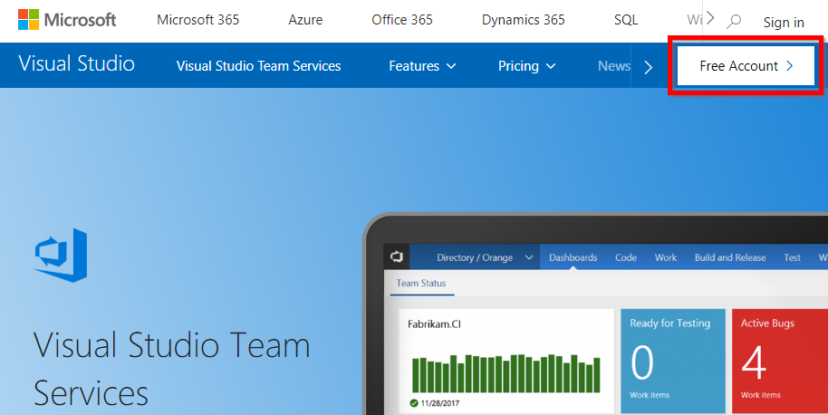
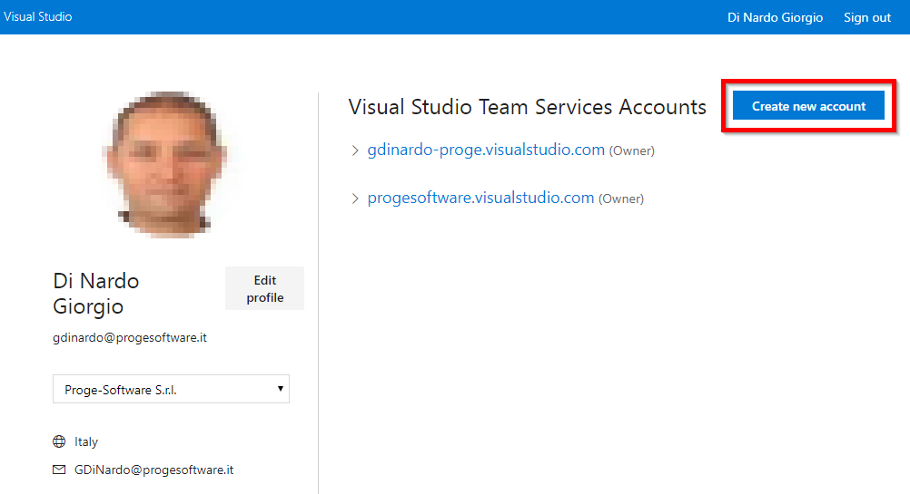
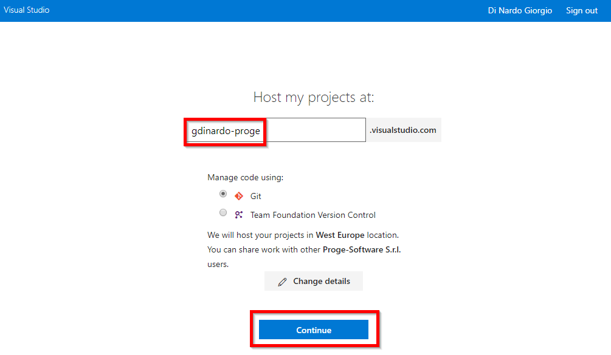
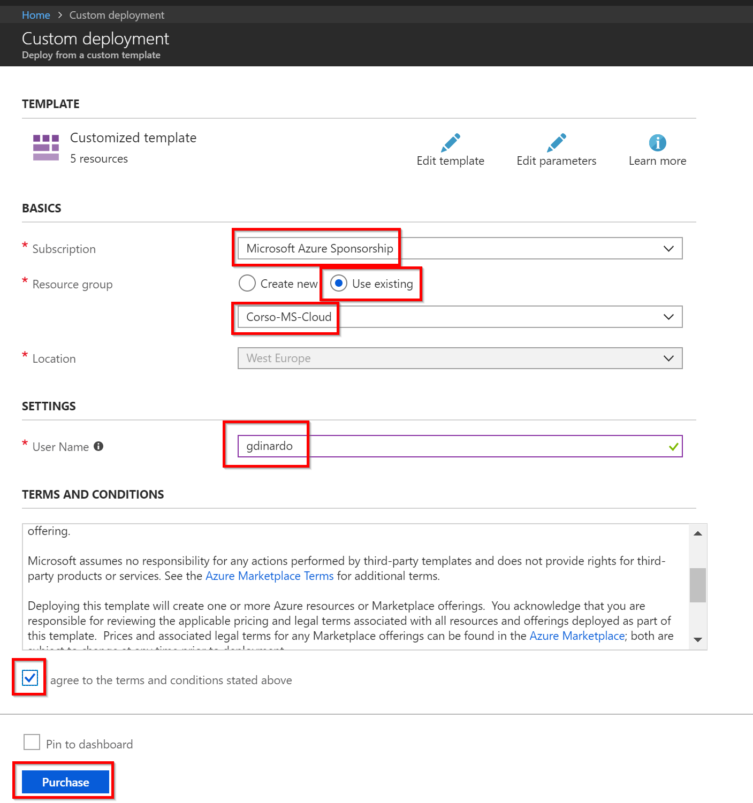
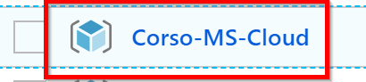
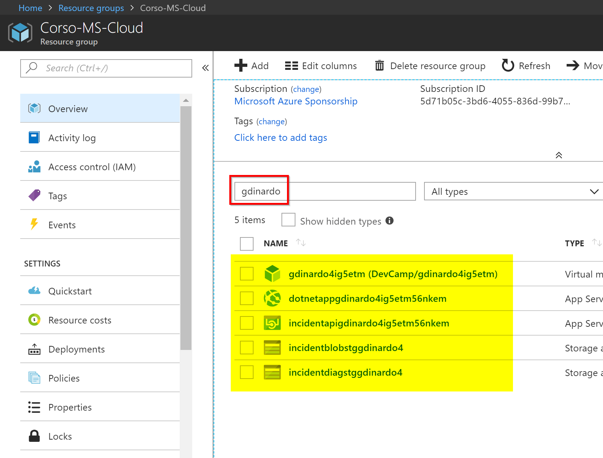
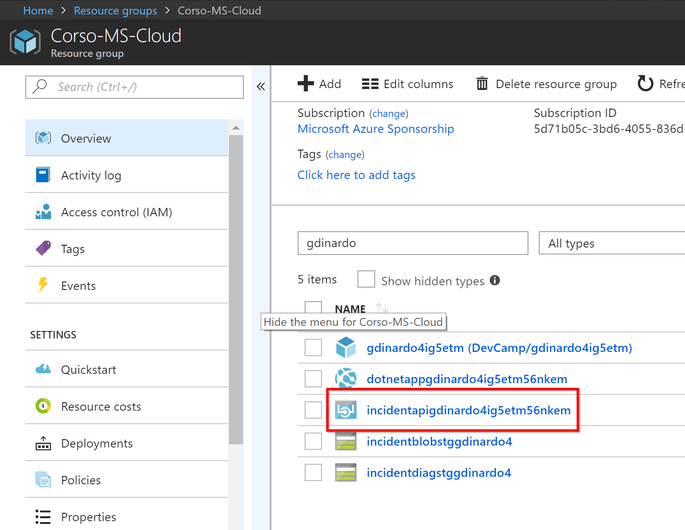
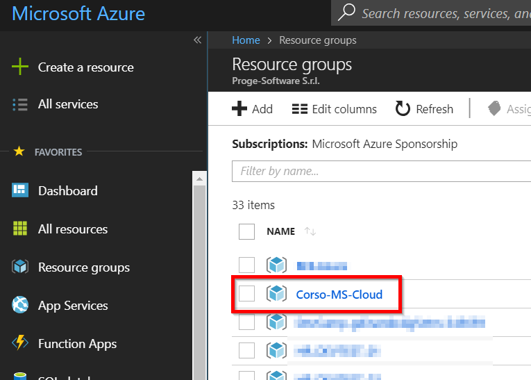

# Developer Environment (.NET)

## Overview

In this lab, you will set up a VSTS account, configure your Azure subscription for the DevCamp, and provision a virtual machine in the subscription to use for development of further labs.

## Objectives

In this hands-on lab, you will set up a VSTS account, and an Azure-based virtual machine for the development environment for subsequent labs in the DevCamp.  To expedite the process, we've prepared a Windows image that you will copy into your own environment, start the virtual machine and connect to it.  You will then configure the components for Azure development.

* Set up an a VSTS account.
* Configure your Azure subscription for DevCamp.
* Create an Azure Virtual Machine for remote development.
* Connect to the Azure Virtual Machine and configure it for development.
* Review the features of the Azure Portal.

## Prerequisites

None.

## Exercises

This hands-on-lab has the following exercises:

* [Exercise 1: Start your VSTS trial subscription](#ex1)
* [Exercise 2: Configure your Azure subscription for DevCamp](#ex2)
* [Exercise 3: Use an Azure Virtual Machine for remote development](#ex3)
* [Exercise 4: Deploy Shared API application](#ex4)
* [Exercise 5: Azure Portal walk-through](#ex5)
* [Exercise 6: View the resources you created](#ex6)

---

## Exercise 1: Start your VSTS trial subscription

In a future lab we will use [Visual Studio Team Services](https://www.visualstudio.com/team-services/), or "VSTS" for short. In this exercise we will enable a free trial subscription.

1. In your browser, go to [www.visualstudio.com/team-services](http://www.visualstudio.com/team-services) and click on `Free Account` in the upper right corner.  

    

    Complete the sign in process if needed using your Proge-Software account:

    

    You should be taken to a screen that looks like this:

    

    Click on `Create new account` to set your VSTS account. Please note that sometimes you may be taken to the following screen directly:

    

    Enter your email name followed by `-proge` and click `Continue`.

---

## Exercise 2: Configure your Azure subscription for DevCamp

1. We have created an Azure Resource Group template that will configure the resources you need in Azure for the DevCamp. To deploy these resources in your Azure subscription, `control + click` on the blue ***Deploy to Azure*** button below:

    :point_right:        :point_left:

1. You should see a new tab open in your browser and open the Azure portal, with a blade that looks like this:

    

1. Select as subscription, choose `Use existing` resource group and select `Corso-MS-Cloud`from the list.

1. Enter your Proge-Software account name as `User Name` (i.e. the part before `@progesoftware.it` in your email address).

1. Check the box that indicates you agree to the terms and conditions, and click the `Purchase` button.

    The Resource Group template will start deploying, and the portal may pin a tile to the dashboard showing the status:

    

    It will also be visible in the **Notifications** dropdown:

    

1. This will take approximately 20-30 minutes to complete. Please do not continue on until the template has completed.

    In a later session, we will take a look at Azure Resource Group templates, and how to manage your infrastructure the same way you manage your code. As a short introduction, a template is a JSON file that contains definitions for the resources you want in your resource group. When you apply the resource group template, Azure will apply the template to your Azure resource group, and create the resources you have specified in the template. This makes it easy to maintain the infrastructure definition in the JSON text file.

    In the resource group template we have created for DevCamp, there are several types of resources including Web Apps and a Virtual Machine. Resource Group Templates are usually fairly quick to apply - the reason this one takes so long is that we are creating a Windows Virtual machine and installing all the tools you will need for the DevCamp including Visual Studio, and other software resources.

1. You will know when the Resource Group finishes provisioning either by the Notification drop-down, or by navigation on the left-hand bar to `Resource Groups` -> `Corso-MS-Cloud` and check the `Deployments` status for `Succeeded`.

    

    Once the Resource Group creation is done, you can visit the resource group by clicking `Resource Groups` on the left navigation pane:

    

1. Then click on your Resource group to open it:

    

---

## Exercise 3: Use an Azure Virtual Machine for remote development

1. The Azure resource group template will have created a virtual machine that can be used for remote development on Windows. Exercise 5 describes the configuration for the Windows virtual machine, which would be appropriate for any of the languages.

1. In the `Corso-MS-Cloud` resource group, select the DevCamp DevTest Lab.

    

1. Find the Windows virtual machine in your DevTest lab. The name will start with your account name:

    

1. In Azure you can automatically shutdown virtual machines e.g. during the night to save costs. This is the case for the machines in our Labs as you can see from the `Auto-Shutdown` flag.

1. Select the machine name and open the virtual machine blade then click `Connect` to connect to the machine using Remote Desktop. If you are not running this course in a single day, you will find the machine stopped we you come back the day after. Click `Start` to re-start the machine before to connect:

    

    This will download a remote desktop connection file, and when you open it, remote desktop on your local machine will attempt to attach to your virtual machine.

    

    When the windows security dialog pops up, the user name `l-admin` should be pre-selected. If not click on the `More choices` link, then choose `Use a different account`.

    

1. Use the following credentials to log on to the machine:

    > User Name = `.\l-admin`
    >
    > Password = `Devc@mp2016!`

    

    > It would be wise to change the password in the virtual machine.

1. When remote desktop is connected, you will see server manager initially.  We will want to turn of IE enhanced security, to make accessing the web within the virtual machine easier.  First click `local server`.

    

1. Then click the `On` next to **IE Enhanced Security Configuration** (if the flag is already `off` you can skip this point).

    

    A dialog box pops up - choose to turn enhanced security off for administrators.

1. We are going to use git to clone the DevCamp github repository to this development machine. Click on the Start menu, and type `cmd`.

    > NOTE: On some high resolution monitors (HIGH DPI), you will notice that the icons and command line windows appear small. If this is an issue, you can download [Remote Desktop Connection Manager 2.7](https://www.microsoft.com/en-us/download/details.aspx?id=44989).

1. Change directory to the root using `cd c:\`.

1. Type `git clone https://github.com/AzureCAT-GSI/DevCamp.git`:

    

    All of the content for this DevCamp will now be located in `c:\DevCamp`.

1. Start Visual Studio using the `Visual Studio 2015` shortcut.

    > Note, there are 2 Visual Studio shortcuts. Make sure you **DO NOT** use the "start experimental instance of visual studio 2015" shortcut.

    

1. On the sign in screen, click `sign in`. Use your Proge-Software Office 365 credentials.

    > Depending on the version of the Windows image and Visual Studio, your start experience may vary:

    

    or

    

1. Create a VSTS repository. Enter a repository name and click continue:

    

1. Create your first team project, and name it `DevCamp`:

    

1. If the VSTS dialog does not appear during your setup process use the `Team Explorer` to open it manually by selecting `Get started for free` in the `Visual Studio Team Services` section.

    

1. Enter a repository name, select `Git` and click `Continue`:

    

1. After the repository has been created click `Clone in Visual Studio`:

    

1. In Visual Studio click `Clone` to confirm the settings.

1. Click close. You are done with the Visual Studio setup.

1. Close the remote desktop connection.

---

## Exercise 4: Deploy shared API application

1. The API application has been prepared for you to be available as a communication partner during different exercises and just needs to be deployed once. It will be first used in the second hands on lab.

1. Open a browser and navigate to [https://portal.azure.com](https://portal.azure.com). Open the resource group `Corso-MS-Cloud` and filter resources by your account name:

    

1. Locate the app service named `incidentapi...` in the resource group blade:

    

1. Click on the app service, which will bring up the app service blade. Click on `Browse` at the top:

    

    A new browser tab will open.

    > If the page looks like the image displayed below, this means the API was automatically deployed from GitHub, and you can skip the rest of this exercise.

    

    > If the page looks like the image below, continue with this exercise

    

1. In the Azure portal, select the API Application (noted with the  icon).

    

1. On the details blade select `Deployment options`.

    

1. If the app deployment is connected, click `Disconnect` on the menu bar.

    

1. Then select `Choose source` in the blade and select `External Repository`.

    

1. Paste the following in the Repository URL field `https://github.com/AzureCAT-GSI/DevCamp.git`.

    

1. Select `OK`.

---

## Exercise 5: Azure Portal walk-through

1. On your local machine or the virtual machine in Azure, open a browser window and go to the main Azure portal page, [http://portal.azure.com](https://portal.azure.com). Log in with your Proge credentials if needed. You should see the Azure portal, similar to this:

    

    There is a lot to notice on this screen.  At the upper left corner, the icon under the `Microsoft Azure` banner allows you to shrink and expand the left bar:

    

    Under that, clicking on the `+ New` item will allow you to create new deployments, virtual machines, databases, etc:

    

1. On the left you will see a list of the Azure services that you can use on the left hand side. Notice that this list will scroll up and down to reveal more services, and finally an item that says `More Services >`:

    

    You can click on any of these and see what items are deployed, and easily create new deployments.

1. At the top of the window you have a search box where you can search for any resources:

    

1. The bell icon is for notifications, and in this screenshot, it indicates that there are two notifications pending:

    

    Clicking on the bell will show you the notifications:

    

    If you click on one of the notifications, you can go to the details blade that matches the content of the notification, e.g. the details blade of the starting virtual machine.

1. The `>_` icon opens the Azure Cloud Shell which gives you authenticated shell access to Azure within the browser. It opens at the bottom of the window.

    

1. The gear at the top of the screen lets you set the color palette for the portal, whether or not there will be animations, and other options for the portal itself:

    

1. The "smiley face" button allows you to send feedback to Microsoft:

    

    Clicking on the icon will give you a form to let us know about your experience:

    

1. The Question icon will give you the ability to enter a support case, manage support requests, or get further information on Azure.

    

1. Your login name and company name on the upper left hand corner has two functions:

    

    If you hover the mouse over your name, you'll get information about your login, the directory and subscription:

    

    If you click on your name, you can sign out, change your password, view your permissions, and view your bill:

    

1. Next we will look at the resource group we set up with the template.  Click on `Resource Groups` on the left hand side:

    

1. Click on the resource group that you created:

    

    A new blade will open with the overview of all of the contents of the resource group listed:

    

    You can click on any of the items on the left hand side which will view or manipulate settings for the resource group as a whole.  If you click on any of the individual resources in the center, you will get more information on that resource.

1. Azure automatically logs changes to resource group and who made those changes. Clicking `Activity log` on the left of the blade will allow you to query the log, and clicking on any logged items will give you additional information on that entry:

    

1. Clicking on `Automation script` will allow you to view, edit or download the resource group template that would create this resource group.

    

1. The Windows VM is managed by an [Azure DevTest lab](https://azure.microsoft.com/en-us/services/devtest-lab/) named `DevCamp` which handles the startup and shutdown of the machine. To change the shut down and start up schedule, click on the DevTest Lab icon and select `Configuration and policies`.

    

1. Select `Auto-shutdown`.

    

    &#x1F53A;Do NOT modify the Auto-shutdown settings&#x1F53A;.

1. The machine does not automatically turn on. To enable this, in the Policy Settings blade, select `Auto-Start`.

    

    &#x1F53A;Do NOT modify the Auto-start settings&#x1F53A;.

> It is particularly useful to create resources in the Azure portal, then save or edit the resource group template.
> Resource group templates will be explained further in a later lab.

---

## Exercise 6: View the resources you created

Going back to the list of resources in the resource group `Corso-MS-Cloud`, we'll go through the list of each resource, with a description.  Feel free to click on the resource and view its detail blade.

Also, our resource group template has added a random string to the end of many of the resources right after your account name.  In this description, we have replaced that string and your account name with `...`:

* `adevcamp...` - Storage account for storing artifacts for the DevTest labs.

* `DevCamp` - This is the DevTest lab that is used to manage the VM images and artifacts.

* `DevCamp...` - This is the Azure Key Vault that is used to manage secure credentials.

* `DevCampVnet` - This is an Azure Virtual Network, which will allow components of the resource group to communicate as if they were on the same physical network.

* `dotnetapp...` - App service for running the .NET application when deployed to the cloud.  If you are not using .NET in the labs, you can safely delete this.

* `incidentapi...` - App service for running the API service that provides a REST API to the web applications.

* `incidentappplan...` - App Service Plan, which defines how the app services in the resource group will be configured.

* `incidentblobstg...` - Storage account for storing the uploaded images and the Azure Queue, from the modern-cloud-apps hands on lab.

* `incidentcache...` - This is the Redis cache that we use from the application to make data access faster.  The modern-cloud-apps hands on lab adds support to the application to be able to leverage the cache.

* `incidentdb...` - This is the CosmosDB database that will hold the JSON incident documents stored by the application.

* `incidentdiagstg...` - Storage account for storing diagnostics from the services in the resource group.

In the second resource group `DevCamp-...`, additional resources were created.

   

They are all called with your account name and a random string but are of different types:

* `Public IP address` - This is a public IP that will allow the Windows development virtual machine to communicate with the Internet (e.g. via Remote Desktop).  If you delete the Windows virtual machine, you can safely delete this.

* `Virtual machine` - This is the Windows server virtual machine that we are using as a development machine for these hands-on-labs. You can delete this machine after the developer-environment lab if you are using an on-premises/local machine for development.

* `Network interface` - This is a public network interface that will allow the Windows development virtual machine to communicate on the network.  If you delete the Windows virtual machine, you can safely delete this.

* `Disk` - Storage account for storing for VHDs for the machines DevTest labs.

---

## Summary

In this hands-on lab, you learned how to:

* Set up a VSTS account.
* Configure your Azure subscription for DevCamp.
* Create an Azure Virtual Machine for development where you can carry out the following hands on labs.
* Connect to the Azure Virtual Machine and configure it for development.
* Use the Azure portal to view the resources that you created giving you a first overview of the management of Azure resources.

After completing this module, you can continue on to Module 2: Building modern cloud apps.

### View Module 2 instructions for [.NET](../02-modern-cloud-apps)

---
Copyright 2018 Microsoft Corporation. All rights reserved. Except where otherwise noted, these materials are licensed under the terms of the MIT License. You may use them according to the license as is most appropriate for your project. The terms of this license can be found at <https://opensource.org/licenses/MIT>.
